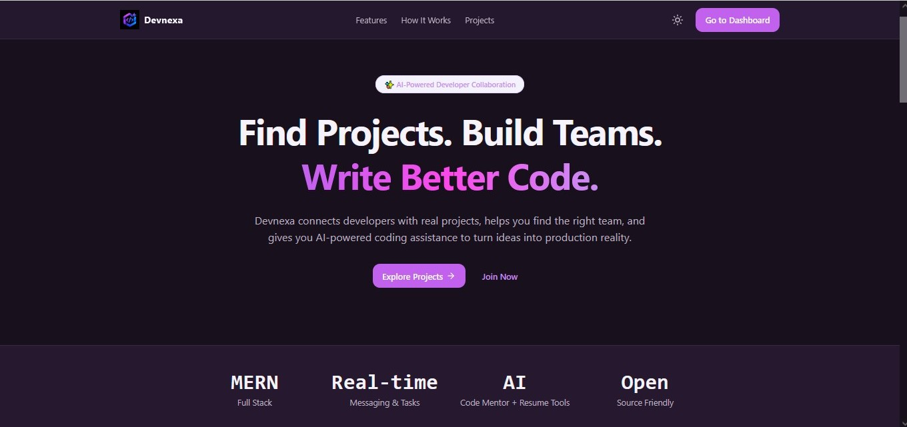
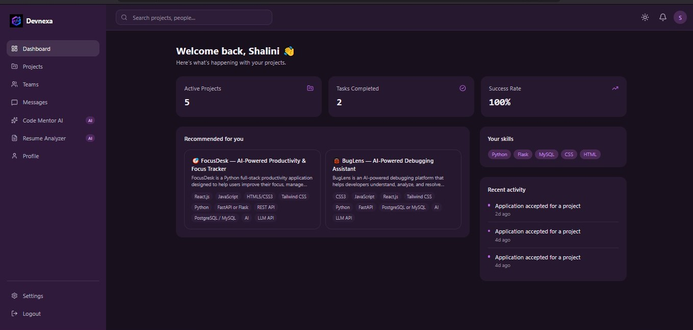
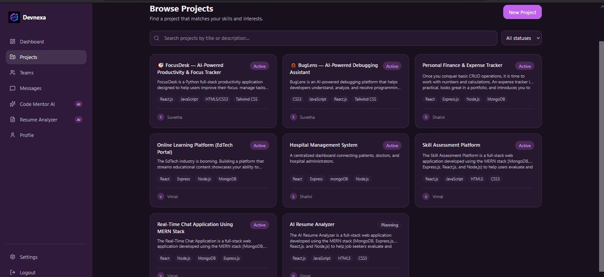
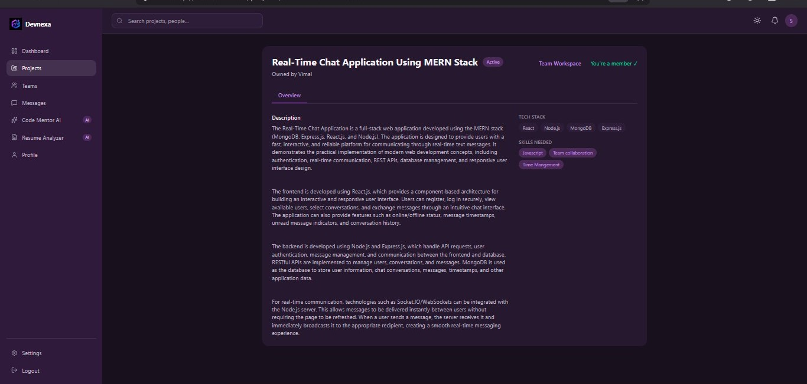
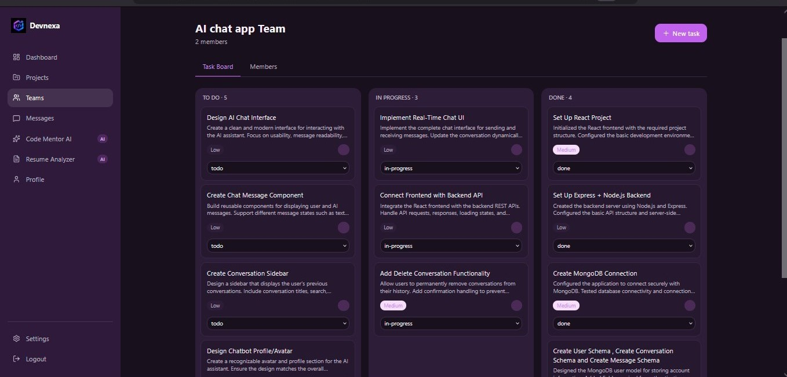
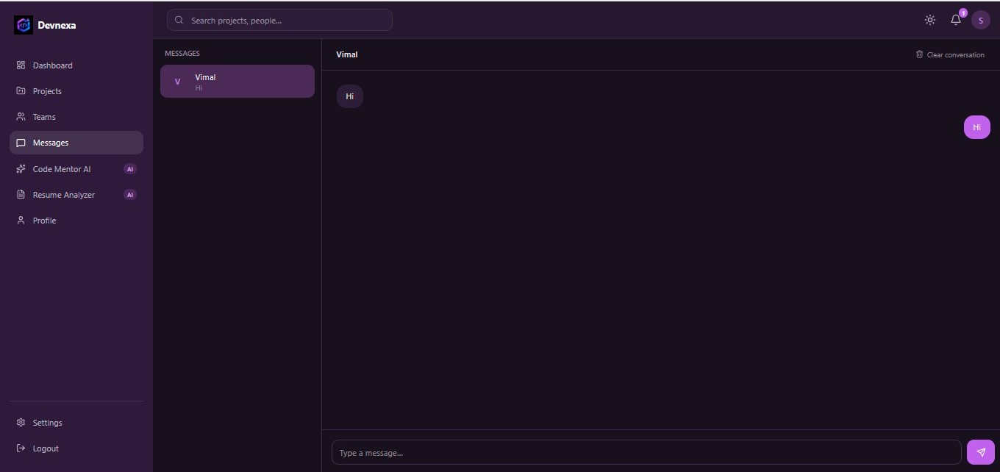
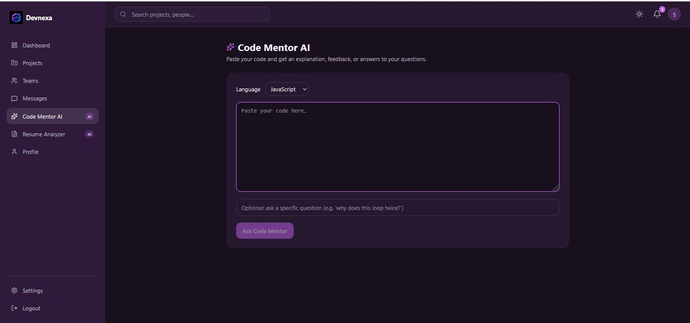
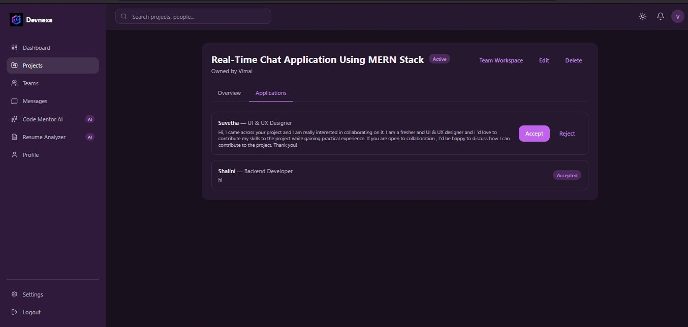

# Devnexa

**Devnexa** is a full-stack MERN platform where developers discover real projects, build teams, collaborate in real-time, and get AI-powered coding and career assistance — all in one place.

Built as an end-to-end portfolio project: authentication, project discovery, team workspaces with task boards, real-time messaging via Socket.io, notifications, AI-powered Code Mentor and Resume Analyzer (Google Gemini), dark mode, and a fully responsive UI.

> **Status:** Fully functional, running locally. Not yet deployed to a live URL.

---

## Screenshots

| Landing Page | Dashboard |
|---|---|
|  |  |

| Browse Projects | Project Details |
|---|---|
|  |  |

| Team Workspace | Messages |
|---|---|
|  |  |

| Code Mentor AI | Settings |
|---|---|
|  |  |

---

## Features

- 🔐 **Authentication** — JWT auth via httpOnly cookies, bcrypt password hashing, protected routes
- 🔍 **Browse Projects** — search, filter by status/tech stack, pagination
- 📝 **Create & manage projects** — full CRUD, ownership-based permissions
- 🙋 **Applications** — apply to join a project, owners accept/reject applicants
- 👥 **Team Workspaces** — auto-created per project, with role-based membership (owner/maintainer/contributor)
- ✅ **Task Boards** — create, assign, and track tasks across To Do / In Progress / Done
- 💬 **Real-time messaging** — Socket.io-powered 1-on-1 chat with live delivery and unread badges
- 🔔 **Notifications** — real-time + persisted, with user-configurable preferences
- 👤 **Developer Profiles** — one reusable component for both editable (own) and read-only (public) views
- 🤖 **Code Mentor AI** — paste code, get an AI-generated explanation or improvement suggestions
- 📄 **AI Resume Analyzer** — paste a resume, get an ATS score plus concrete strengths/improvements
- ⚙️ **Settings** — account management, password change, notification preferences, account deletion
- 🌗 **Dark / light mode** — theme toggle with persistence
- 📱 **Fully responsive** — mobile, tablet, and desktop layouts throughout

---

## Tech Stack

**Frontend**
- React 19 + Vite
- Tailwind CSS v4
- React Router
- React Hook Form
- Axios
- Socket.io Client
- Lucide React (icons)

**Backend**
- Node.js + Express (ES Modules)
- MongoDB + Mongoose
- Socket.io
- JWT (httpOnly cookies) + bcryptjs
- Google Gemini API (`@google/genai`)
- express-validator, express-rate-limit, Helmet, compression

---

## Project Structure

```
devnexa/
├── backend/
│   ├── src/
│   │   ├── config/         # env, database, Gemini AI client
│   │   ├── models/         # Mongoose schemas
│   │   ├── routes/         # Express route definitions
│   │   ├── controllers/    # request handlers
│   │   ├── services/       # business logic (AI providers, notifications)
│   │   ├── middleware/     # auth, validation, rate limiting, error handling
│   │   ├── validators/     # express-validator rule sets
│   │   ├── sockets/        # Socket.io server + auth
│   │   ├── utils/          # ApiError, ApiResponse, asyncHandler
│   │   ├── app.js
│   │   └── server.js
│   └── package.json
├── frontend/
│   ├── src/
│   │   ├── api/             # Axios calls per resource
│   │   ├── components/      # organized by domain (ui, layout, projects, tasks, etc.)
│   │   ├── context/         # Auth, Socket, Theme contexts
│   │   ├── hooks/
│   │   ├── pages/           # one file per route
│   │   ├── lib/             # constants, helpers
│   │   └── App.jsx
│   └── package.json
├── screenshots/
└── README.md
```

---

## Getting Started Locally

### Prerequisites
- Node.js 18+
- A MongoDB instance (local install, or a free [MongoDB Atlas](https://www.mongodb.com/cloud/atlas) cluster)
- A free [Google Gemini API key](https://aistudio.google.com)

### 1. Clone the repo
```bash
git clone https://github.com/YOUR_USERNAME/devnexa.git
cd devnexa
```

### 2. Backend setup
```bash
cd backend
npm install
```

Create a `.env` file in `backend/`:
```env
NODE_ENV=development
PORT=5000

MONGODB_URI=mongodb://127.0.0.1:27017/devnexa

JWT_SECRET=replace-with-a-long-random-secret
JWT_EXPIRES_IN=7d
COOKIE_NAME=your-token-name

CLIENT_URL=http://localhost:5173

GEMINI_API_KEY=your-gemini-api-key
```

Run it:
```bash
npm run dev
```
Backend runs at `http://localhost:5000`.

### 3. Frontend setup
```bash
cd ../frontend
npm install
```

Create a `.env` file in `frontend/`:
```env
VITE_API_BASE_URL=/api/v1
```

Run it:
```bash
npm run dev
```
Frontend runs at `http://localhost:5173`.

### 4. Open the app
Visit `http://localhost:5173`, register an account, and explore.

---

## Environment Variables Reference

### Backend (`backend/.env`)
| Variable | Description |
|---|---|
| `NODE_ENV` | `development` or `production` |
| `PORT` | Port the API server runs on |
| `MONGODB_URI` | MongoDB connection string |
| `JWT_SECRET` | Secret used to sign JWTs — must be long and random |
| `JWT_EXPIRES_IN` | Token lifetime (e.g. `7d`) |
| `COOKIE_NAME` | Name of the httpOnly auth cookie |
| `CLIENT_URL` | Frontend origin, used for CORS and cookie settings |
| `GEMINI_API_KEY` | Google Gemini API key for AI features |

### Frontend (`frontend/.env`)
| Variable | Description |
|---|---|
| `VITE_API_BASE_URL` | Base URL for API requests (relative path in dev; would point to a hosted backend URL if deployed) |

---

## Architecture Notes

- **Auth:** JWT stored in an httpOnly cookie (not localStorage) — inaccessible to client-side JavaScript, mitigating XSS-based token theft.
- **Authorization:** every mutating endpoint re-verifies ownership/role server-side; the frontend is never trusted as the source of truth.
- **AI provider abstraction:** AI calls are isolated behind a `services/ai/` layer, so the underlying model/provider can be swapped without touching controllers, routes, or the frontend.
- **Real-time:** Socket.io authenticates each connection via the same JWT cookie used for REST requests, and uses per-user rooms (`user:<id>`) to push messages and notifications live.
- **Cascading deletes:** deleting a project cleans up its team, tasks, and applications; deleting an account cleans up owned projects and team memberships — avoiding orphaned data.

---

## Roadmap / Possible Future Improvements

- Deploy to a live URL (MongoDB Atlas + Render/Railway + Vercel)
- Resume file upload (PDF parsing) instead of pasted text
- Per-conversation read receipts for messaging
- Automated test coverage (backend and frontend)
- CI pipeline (GitHub Actions) running checks on every push

---

## License

This project is built for portfolio and educational purposes.

---

## Author

Built by Suvetha 
